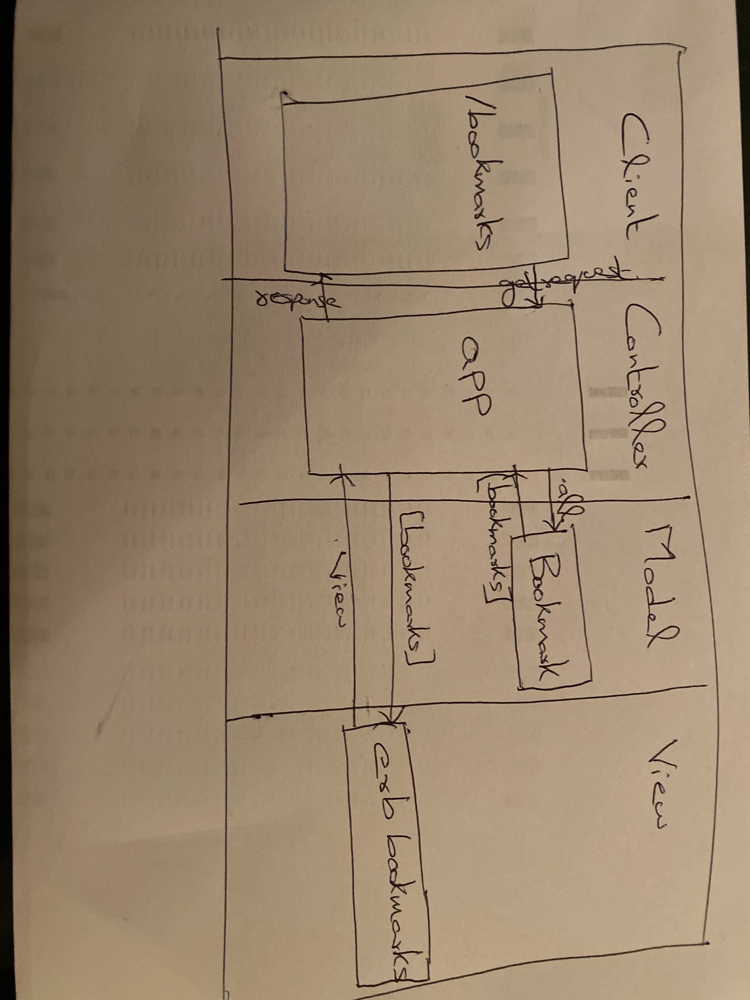

# bookmark-manager

###User  stories

As a <Stakeholder>,
So that <Motivation>,
I'd like <Task>.

As a User
So that I can keep a record of interesting websites,
I'd like to view a list of bookmarks.



### How to create a table

```
CREATE [TEMP] TABLE [IF NOT EXISTS] table_name(
   pk SERIAL PRIMARY KEY,
   c1 type(size) NOT NULL,
   c2 type(size) NULL,
   ...
);
```
```
Connect to psql
Create the database using the psql command CREATE DATABASE bookmark_manager;
Connect to the database using the pqsl command \c bookmark_manager;
Run the query we have saved in the file 01_create_bookmarks_table.sql
```

### Postgres sql CRUD instructions:
```
1. Using SELECT to view the table

From psql, list all the existing bookmarks:

bookmark_manager=# SELECT * FROM bookmarks;
This command displays all columns from the table "bookmarks" and shows us an empty table:

id | url
----+------
(0 rows)

2. Using INSERT to add data to a table

Manual ID

We can add data using INSERT in a very manual way:

bookmark_manager=# INSERT INTO bookmarks VALUES(1, 'http://www.makersacademy.com');
Notice, however, that we have to manually specify the ID (the 1 in the line above) to add data like this. Remember that IDs are meant to be unique. That means that we get a funky error if we try to do this immediately after the above step:

bookmark_manager=# INSERT INTO bookmarks VALUES(1, 'http://www.makersacademy.com');
Automatic ID

Since we told ID to be a SERIAL type, PostgreSQL will figure out how to increment it on its own. We simply have to scope the value we're interested in inserting:

bookmark_manager=# INSERT INTO bookmarks (url) VALUES ('http://www.makersacademy.com');
Let's add the other three (I'll remove the prompt so there's more space):

INSERT INTO bookmarks (url) VALUES ('http://www.askjeeves.com');
INSERT INTO bookmarks (url) VALUES ('http://www.twitter.com');
INSERT INTO bookmarks (url) VALUES ('http://www.google.com');
3. Using SELECT to query data

We've already seen how to list all the records in the table:

bookmark_manager=# SELECT * FROM bookmarks;
It's a good idea to sanity-check each step you take with frequent use of SELECT.
However, we can do more exciting things with SELECT. For instance, we can limit the number of records to the top two:

bookmark_manager=# SELECT * FROM bookmarks LIMIT 2;
Or even scope our query to specific rows of data:

bookmark_manager=# SELECT * FROM bookmarks WHERE url = 'http://www.makersacademy.com';
4. Using DELETE to delete data

To delete a row from a database table, we can do the following:

DELETE FROM bookmarks WHERE url = 'http://www.twitter.com';
5. Using UPDATE to update data

To update a table row, we can do this:

UPDATE bookmarks SET url = 'http://www.destroyallsoftware.com' WHERE url = 'http://www.askjeeves.com';
```
### Creating a Testing Environment

```
Create a test database using psql
- psql
- CREATE DATABASE "bookmark_manager_test";
- CREATE TABLE bookmarks(id SERIAL PRIMARY KEY, url VARCHAR(60));
```
